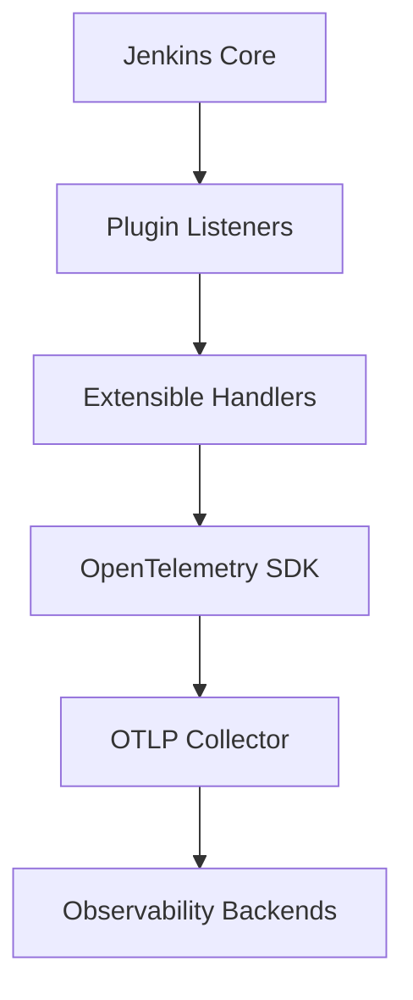
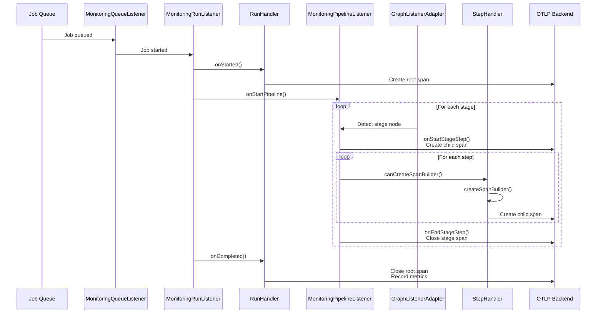
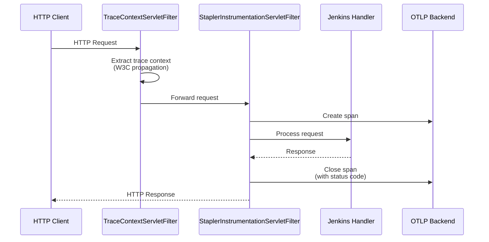
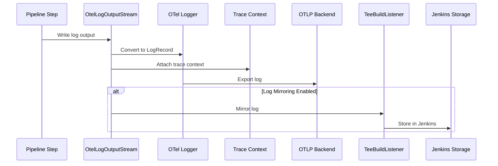

# AGENTS

Agent instructions for the Jenkins OpenTelemetry Plugin.

## Project Overview

**Artifact**: `io.jenkins.plugins:opentelemetry`  
**Type**: Jenkins HPI Plugin (`.hpi` packaging)  
**Language**: Java 21  
**Build Tool**: Maven  

**Purpose**: Monitor and observe Jenkins with OpenTelemetry. Provides distributed tracing for pipeline executions, HTTP requests, metrics collection, and log storage integration with observability backends (Elastic, Jaeger, Grafana, Dynatrace).

**Note**: Version information for dependencies can be found in `pom.xml`.

## Design Principles

Follow these principles when making changes:

- **KISS (Keep It Simple, Stupid)**: Straightforward implementations without over-engineering
- **TDA (Tell, Don't Ask)**: Objects encapsulate behavior and tell what to do rather than exposing state
- **YAGNI (You Aren't Gonna Need It)**: Only implement features that are actually needed
- **DRY (Don't Repeat Yourself)**: Reuse code through well-defined abstractions
- **Structured Programming**: Clear control flow with minimal complexity

## Setup Commands

### Prerequisites
- Java 21 or later
- Maven 3.8.x or later

### Build
```bash
./mvnw clean install
```

### Run with Jenkins
```bash
./mvnw hpi:run
```
This starts Jenkins on http://localhost:8080/jenkins with the plugin loaded.

### Run Demo Environments
```bash
cd demos
make start-elastic  # Elastic Stack (Elasticsearch, Kibana, APM)
make start-grafana  # Grafana Stack (Tempo, Loki)
make start          # Base stack
make stop           # Stop all containers
```

### Code Formatting with Spotless
```bash
# Check code formatting
./mvnw spotless:check

# Apply code formatting
./mvnw spotless:apply
```

### Static Analysis
```bash
# Run SpotBugs analysis
./mvnw spotbugs:check

# Run Error Prone analysis
./mvnw clean verify -P error-prone-check
```

## Code Style Guidelines

### General Java Conventions
- Use `@NonNull` and `@CheckForNull` annotations from FindBugs
- Never return null; use `Optional` for potentially absent values
- Use `@Extension` annotation for Jenkins extension points
- Mark optional extensions with `@Extension(optional = true, dynamicLoadable = YesNoMaybe.YES)`
- Prefer composition over inheritance
- Use interface-based design for extensibility

### Java Best Practices

#### Code Organization
- Keep classes focused on a single responsibility (Single Responsibility Principle)
- Classes should be small: aim for fewer than 200 lines when possible
- Methods should be concise: aim for fewer than 20 lines
- Limit method parameters to 3-4; use parameter objects for more complex cases
- Group related functionality into cohesive packages

#### Naming Conventions
- Classes/Interfaces: Use `PascalCase` (e.g., `MonitoringRunListener`)
- Methods/Variables: Use `camelCase` (e.g., `createSpanBuilder`)
- Constants: Use `UPPER_SNAKE_CASE` (e.g., `MAX_RETRY_ATTEMPTS`)
- Packages: Use lowercase, concatenated words (e.g., `io.jenkins.plugins.opentelemetry`)
- Use meaningful, descriptive names that reveal intent
- Avoid abbreviations unless widely recognized (e.g., `HTTP`, `URL`)
- Boolean variables/methods should indicate true/false (e.g., `isEnabled`, `hasPermission`)

#### Error Handling
- Catch specific exceptions rather than generic `Exception`
- Never catch `Throwable` or `Error` unless absolutely necessary
- Don't ignore exceptions; at minimum, log them
- Use try-with-resources for `AutoCloseable` resources
- Prefer checked exceptions for recoverable conditions
- Document exceptions with `@throws` in Javadoc

#### Null Safety
- Prefer `Optional<T>` over returning null for methods that may not have a value
- Use `@NonNull` and `@CheckForNull` annotations consistently
- Validate method parameters at the beginning of methods
- Avoid passing null as arguments; use overloaded methods instead
- Initialize collections to empty rather than null

#### Collections and Streams
- Prefer immutable collections when possible (e.g., `List.of()`, `Set.of()`)
- Use `Collections.unmodifiableList()` for defensive copies
- Use streams for data processing, but keep pipelines readable (max 3-4 operations)
- Prefer method references over lambdas when possible (e.g., `String::length`)
- Use appropriate collection types: `List` for ordered, `Set` for uniqueness, `Map` for key-value

#### Performance Considerations
- Avoid premature optimization; measure before optimizing
- Use `StringBuilder` for string concatenation in loops
- Cache expensive computations when appropriate
- Be mindful of boxing/unboxing with primitives in collections
- Use lazy initialization for expensive objects when appropriate
- Prefer primitive types over wrapper classes when nullability isn't needed

#### Concurrency
- Minimize mutable shared state
- Use `java.util.concurrent` classes over raw synchronization
- Prefer `ExecutorService` over creating threads directly
- Document thread-safety guarantees in class Javadoc
- Use `volatile` for flags that need visibility guarantees
- Avoid `synchronized` on public methods; use private locks instead

#### Testing
- Write tests for all public APIs
- Use meaningful test method names that describe what is being tested
- Follow Arrange-Act-Assert (AAA) pattern
- Keep tests focused: one logical assertion per test
- Use `@Test(expected = Exception.class)` or `assertThrows()` for exception testing
- Mock external dependencies; test units in isolation

#### Code Comments
- Write self-documenting code; let code explain "what" and comments explain "why"
- Document all public APIs with Javadoc
- Include examples in Javadoc for complex methods
- Keep comments up-to-date; outdated comments are worse than no comments
- Avoid obvious comments that restate the code
- Use `TODO` and `FIXME` tags for pending work, with issue references

#### Modern Java Features (Java 17+)
- Use records for immutable data carriers
- Use sealed classes for restricted inheritance hierarchies
- Use pattern matching where applicable (instanceof, switch)
- Use text blocks for multi-line strings
- Use var for local variables when type is obvious from context
- Use enhanced switch expressions with yield

### Formatting Rules (enforced by Spotless)
- **Indentation**: 4 spaces for Java, 2 spaces for YAML/JSON
- **Line length**: Maximum 120 characters
- **End of line**: LF (Unix style)
- **Charset**: UTF-8
- **Trailing whitespace**: Removed in Java files
- **Final newline**: Not required in most files, required in YAML/JSON/shell scripts
- Always run `./mvnw spotless:apply` before committing

### Static Analysis (SpotBugs/FindBugs)
- All code must pass SpotBugs checks without warnings
- Use FindBugs annotations to document nullability:
  - `@NonNull` - Parameter/return value cannot be null
  - `@CheckForNull` - May return null (prefer Optional instead)
  - `@SuppressFBWarnings` - Only when necessary with justification
- Run `./mvnw spotbugs:check` to verify before committing

### Handler Pattern
All handlers must implement:
```java
@Override
public boolean canCreateSpanBuilder(@NonNull Run<?, ?> run) {
    // Check capability
}

@Override
public int ordinal() {
    return 100; // Lower executes first
}

@Override
public int compareTo(OtherHandler other) {
    if (this.ordinal() == other.ordinal()) {
        return this.getClass().getName().compareTo(other.getClass().getName());
    }
    return Integer.compare(this.ordinal(), other.ordinal());
}
```

### Naming Conventions
- Listener classes end with `Listener` (e.g., `MonitoringRunListener`)
- Handler classes end with `Handler` (e.g., `RunHandler`, `CauseHandler`)
- Backend classes end with `Backend` (e.g., `ElasticBackend`)
- Use semantic attribute names from OpenTelemetry conventions
- Configuration classes use `Configuration` suffix

### TDA (Tell, Don't Ask) Examples
**Bad** (Asking):
```java
if (run.getResult() == Result.FAILURE) {
    span.setAttribute("status", "failed");
}
```

**Good** (Telling):
```java
span.setStatus(StatusCode.ERROR);
```

### Markdown Best Practices

When editing documentation files, follow these markdown conventions:

#### Headings
- Use ATX-style headings (`#`, `##`, `###`) not underline style
- One H1 (`#`) per document for the title
- Don't skip heading levels (e.g., don't jump from `##` to `####`)
- Add blank line before and after headings
- Use sentence case for headings, not title case

#### Code Blocks
- Always specify language for syntax highlighting:
  ```java
  public class Example {}
  ```
- Use `bash` for shell commands, not `sh` or `shell`
- Use inline code (backticks) for: class names, method names, file paths, commands, property names
- Examples: `MonitoringRunListener`, `pom.xml`, `./mvnw verify`

#### Links
- Use descriptive link text, not "click here" or URLs
- Good: `[OpenTelemetry Specification](https://opentelemetry.io/docs/specs/otel/)`
- Bad: `Click [here](url)` or bare URLs
- Use relative paths for internal documentation links

#### Lists
- Use `-` for unordered lists (consistent bullet style)
- Add blank line before and after lists
- Indent nested lists with 2 spaces
- Use `1.` for ordered lists (number will auto-increment)
- Keep list items parallel in structure

#### Emphasis
- Use `**bold**` for UI elements, important terms, emphasis
- Use `*italic*` sparingly for subtle emphasis or citations
- Don't use bold for code elements; use backticks instead

#### Line Length
- Aim for 120 characters maximum per line (matching code style)
- Break at sentence boundaries when possible
- Exception: long URLs, code blocks, or tables

#### Tables
- Align columns for readability in source
- Include header separator row with at least 3 dashes per column
- Example:
  ```markdown
  | Column 1 | Column 2 |
  |----------|----------|
  | Value 1  | Value 2  |
  ```

#### Spacing
- One blank line between sections
- Two blank lines before top-level (`##`) headings for visual separation
- No trailing whitespace
- File should end with single newline

### YAML Best Practices

When editing YAML files (JCasC, workflows, configurations), follow these conventions:

#### Indentation and Structure
- Use **2 spaces** for indentation (never tabs)
- Keep consistent indentation throughout the file
- Align nested elements properly
- Use blank lines to separate logical sections

#### Syntax
- Use lowercase for: `true`, `false`, `null` (not `True`, `FALSE`, `~`)
- Quote strings containing special characters: `:`, `{`, `}`, `[`, `]`, `,`, `&`, `*`, `#`, `?`, `|`, `-`, `<`, `>`, `=`, `!`, `%`, `@`, `` ` ``
- Quote strings that could be interpreted as numbers or booleans: `"1.0"`, `"yes"`, `"no"`
- Use multiline strings with `|` (literal) or `>` (folded) for long text:
  ```yaml
  description: |
    This is a multiline
    description that preserves
    line breaks.
  ```

#### Lists
- Use `-` for list items with consistent indentation
- Prefer flow style `[item1, item2]` only for short, simple lists
- Keep complex items in block style:
  ```yaml
  dependencies:
    - groupId: io.opentelemetry
      artifactId: opentelemetry-api
    - groupId: io.opentelemetry
      artifactId: opentelemetry-sdk
  ```

#### Maps/Objects
- Use explicit keys without quotes when possible
- Order keys logically (e.g., name/id first, config after)
- Group related configuration together

#### Comments
- Use `#` for comments with a space after: `# This is a comment`
- Add comments above the line they describe, not inline
- Use comments to explain non-obvious configuration choices

#### Best Practices
- Keep files under 500 lines; split large configs into multiple files
- Validate YAML syntax before committing (use `yamllint` or IDE validation)
- Avoid anchors (`&`) and aliases (`*`) unless necessary for DRY
- Don't use complex multiline keys or values when simple structures suffice
- Ensure sensitive values use Jenkins credentials, not plain text

#### Example
```yaml
# OpenTelemetry configuration for Jenkins
otel:
  endpoint: "http://localhost:4317"
  protocol: grpc
  authentication:
    type: bearer
    credentials: ${OTEL_TOKEN}
  
  exporters:
    - type: otlp
      enabled: true
      timeout: 30
```

### Technical Documentation Best Practices

When creating or updating technical documentation, follow these principles:

#### Content Requirements
- **Correct**: Documentation must be accurate and free from errors. Wrong documentation is worse than no documentation
- **Current**: Keep documentation up-to-date with code changes. Regular reviews are essential
- **Understandable**: Write for the target audience. Use clear language, explain reasons, provide context
- **Relevant**: Focus on task-oriented content that stakeholders actually need

#### Structural Requirements
- **Referenceable**: Number sections, diagrams, and tables consistently (e.g., "Fig. 3.1", "Table 2.1")
- **Easy to find**: Organize top-down, use templates (like arc42), provide table of contents with hyperlinks
- **Maintainable**: Abstract away details when possible, avoid documenting every implementation detail

#### Process Requirements
- **Version controlled**: All documentation artifacts should be in version control (Git)
- **Continuously updated**: Document incrementally, include documentation in Definition of Done
- **Use appropriate tools**: Prefer established tools over new ones to reduce maintenance burden

#### Writing Guidelines
- Use active voice and positive statements (avoid negation)
- Keep sentences concise (15-20 words average)
- Correct spelling and grammar are essential
- Combine diagrams with explanatory text
- Provide glossary for specific terms
- Explain reasons behind decisions, not just what was decided

#### Maintainability Tips
- Leave out obvious or low-value details
- Abstract: show aggregations instead of all elements
- Document what you can promise to maintain
- Regularly delete outdated content
- Keep diagram source files under version control
- Automation helps with publishing, but not with content creation

### Package Organization
- `authentication/` - OTLP authentication mechanisms
- `backend/` - Observability backend integrations
- `computer/` - Jenkins agent monitoring
- `init/` - Plugin initialization
- `job/` - Job and pipeline monitoring
  - `job/cause/` - Build trigger handlers
  - `job/runhandler/` - Run type handlers
  - `job/step/` - Pipeline step handlers
  - `job/log/` - Build log management
- `queue/` - Build queue monitoring
- `security/` - Security event monitoring
- `semconv/` - Semantic conventions
- `servlet/` - HTTP request tracing

## Testing Instructions

### Run All Tests
```bash
./mvnw clean verify
```

### Run Specific Test
```bash
./mvnw test -Dtest=MonitoringRunListenerTest
```

### Run Integration Tests with Testcontainers
```bash
./mvnw verify -pl :opentelemetry -Pintegration-tests
```

### Test Coverage
- Unit tests use Mockito for Jenkins API mocking
- Integration tests use Testcontainers for Elastic/Jaeger
- Pipeline tests use Jenkins test harness
- All handler implementations must have tests
- Tests must verify OpenTelemetry span/metric creation

### Adding Tests
When adding new features:
1. Add unit tests for the component
2. Add integration tests if it involves external systems
3. Verify spans are created with correct attributes
4. Test error cases and edge conditions
5. Run `./mvnw verify` before committing

### Test Utilities
- `ExtendedGitSampleRepoRule` - Git repository testing
- `ElasticStack` - Testcontainers for Elastic
- Configuration as Code test harness

## Pull Request Guidelines

### Before Opening PR
1. Format code: `./mvnw spotless:apply`
2. Check formatting: `./mvnw spotless:check`
3. Run static analysis: `./mvnw spotbugs:check`
4. Run full test suite: `./mvnw clean verify`
5. Run Error Prone: `./mvnw clean verify -P error-prone-check`
6. Verify all tests pass
7. Update documentation if adding features
8. Add changelog entry if applicable

### PR Title Format
```
[JENKINS-XXXXX] Brief description of change
```
Or for minor changes without JIRA:
```
Fix typo in MonitoringRunListener
```

### PR Description Must Include
- What problem does this solve?
- How to test the change
- Any breaking changes
- Screenshots for UI changes
- Link to JIRA issue if applicable

### Commit Messages
Follow [conventional commits](https://www.conventionalcommits.org/):
```
feat: add support for custom trace attributes
fix: correct span timing for parallel branches
docs: update AGENTS.md with testing instructions
test: add integration tests for Grafana backend
```

### Code Review Expectations
- All handlers must follow the ordinal pattern
- Code must pass Spotless, SpotBugs, and Error Prone checks
- Proper use of `@NonNull` and `@CheckForNull` annotations
- No new dependencies without justification
- Security considerations documented
- Performance impact assessed
- Backward compatibility maintained

## Architecture Overview

Event-driven architecture using Jenkins extension points and OpenTelemetry SDK.

### High-Level Flow


### Key Extension Points
1. **RunListener** → `MonitoringRunListener` - Build lifecycle events
2. **GraphListener** → `GraphListenerAdapterToPipelineListener` - Pipeline events  
3. **ServletFilter** → `TraceContextServletFilter` - HTTP tracing
4. **ComputerListener** → `MonitoringComputerListener` - Agent events
5. **QueueListener** → `MonitoringQueueListener` - Queue events
6. **SecurityListener** → `AuditingSecurityListener` - Security events

## Core Components for Development

### Configuration Entry Points
1. **`JenkinsOpenTelemetryPluginConfiguration`** - Global config, OTLP endpoint, authentication
2. **`JenkinsControllerOpenTelemetry`** - SDK lifecycle singleton
3. **`OpenTelemetryConfiguration`** - Properties, environment variables

### Authentication Implementations  
Extend `OtlpAuthentication`: `NoAuthentication`, `BearerTokenAuthentication`, `HeaderAuthentication`

### Observability Backends
Extend `ObservabilityBackend`: `ElasticBackend`, `JaegerBackend`, `ZipkinBackend`, `GrafanaBackend`, `DynatraceBackend`

### Monitoring Components
- **Job Monitoring**: `MonitoringRunListener` delegates to `RunHandler` implementations
- **Pipeline Monitoring**: `MonitoringPipelineListener` implements `PipelineListener` interface
- **HTTP Tracing**: `TraceContextServletFilter`, `StaplerInstrumentationServletFilter`  
- **Agent Monitoring**: `MonitoringComputerListener`, `MonitoringCloudListener`
- **Queue Monitoring**: `MonitoringQueueListener`
- **Security Monitoring**: `AuditingSecurityListener`
- **Log Management**: `OtelLogSenderBuildListener`, `OtelLogOutputStream`

## Extension Points & Handlers

### Handler Pattern Requirements
All handlers implement:
- `isSupported()` / `canCreateSpanBuilder()` - Check if handler applies
- `ordinal()` - Execution order (lower runs first)
- `configure(ConfigProperties)` - Optional configuration
- `compareTo()` - For deterministic ordering

### Handler Types

**RunHandler** - Different run types (Pipeline, Freestyle, Maven)
```java
@Extension(optional = true)
public class MyRunHandler implements RunHandler {
    @Override
    public boolean canCreateSpanBuilder(@NonNull Run<?, ?> run) {
        return run instanceof MyRunType;
    }
    
    @Override
    public SpanBuilder createSpanBuilder(@NonNull Run<?, ?> run, @NonNull Tracer tracer) {
        return tracer.spanBuilder("jenkins.run.my_type")
            .setAttribute("my.attribute", value);
    }
    
    @Override
    public int ordinal() { return 100; }
}
```

**StepHandler** - Pipeline steps (sh, bat, git)
```java
@Extension
public class MyStepHandler implements StepHandler {
    @Override
    public boolean canCreateSpanBuilder(@NonNull FlowNode node, @NonNull WorkflowRun run) {
        return node instanceof StepAtomNode 
            && ((StepAtomNode) node).getDescriptor() instanceof MyStepDescriptor;
    }
    
    @Override
    public SpanBuilder createSpanBuilder(@NonNull FlowNode node, @NonNull WorkflowRun run, @NonNull Tracer tracer) {
        return tracer.spanBuilder("jenkins.step.my_step");
    }
}
```

**CauseHandler** - Build triggers (GitHub, GitLab, User)
```java
@Extension(optional = true)
public class MyCauseHandler implements CauseHandler {
    @Override
    public boolean isSupported(@NonNull Cause cause) {
        return cause instanceof MyCause;
    }
    
    @Override
    public String getStructuredDescription(@NonNull Cause cause) {
        return "MyCause:" + ((MyCause) cause).getId();
    }
    
    @Override
    public int ordinal() { return 100; }
}
```

## Key Dependencies

### Core (bundled with plugin)
- `io.opentelemetry:opentelemetry-bom` - OpenTelemetry API/SDK
- `io.opentelemetry.instrumentation:opentelemetry-instrumentation-bom` - Instrumentation
- `io.opentelemetry.semconv:opentelemetry-semconv` - Semantic conventions
- `co.elastic.clients:elasticsearch-java` - Elasticsearch client

### Jenkins Plugins (required)
- `io.jenkins.plugins:opentelemetry-api` - OpenTelemetry wrapper
- `org.jenkins-ci.plugins.workflow:workflow-*` - Pipeline support
- `org.jenkins-ci.plugins:credentials` - Credential management

### Jenkins Plugins (optional)
- `org.jenkins-ci.plugins:git` - Git SCM
- `org.jenkins-ci.plugins:github-branch-source` - GitHub
- `org.jenkins-ci.plugins:gitlab-plugin` - GitLab
- `org.jenkins-ci.plugins:bitbucket` - Bitbucket
- `org.jenkins-ci.plugins:job-dsl` - Job DSL

### Adding Dependencies
1. Check if already provided by parent POM
2. Use dependency management for version control 
3. Exclude transitive dependencies that conflict with Jenkins
4. Test with minimal Jenkins version (see `pom.xml` for baseline)

## Package Structure

```
io.jenkins.plugins.opentelemetry/
├── authentication/          # OTLP authentication (NoAuth, Bearer, Header)
├── backend/                # Backend integrations (Elastic, Jaeger, Grafana, etc.)
│   ├── custom/            # Custom backend implementations
│   ├── elastic/           # Elasticsearch log retrieval
│   └── grafana/           # Loki log retrieval
├── computer/               # Agent lifecycle monitoring
├── init/                   # Plugin initialization, JUL bridging
├── jenkins/                # Jenkins core integration
├── job/                    # Job and pipeline monitoring
│   ├── cause/             # Build trigger handlers (GitHub, GitLab, User, etc.)
│   ├── jenkins/           # Pipeline listeners and adapters
│   ├── log/               # Log capture and export
│   ├── runhandler/        # Run type handlers (Pipeline, Freestyle, etc.)
│   └── step/              # Pipeline step handlers (sh, bat, git, etc.)
├── queue/                  # Build queue monitoring
├── security/               # Security event monitoring
├── semconv/                # Semantic conventions (attributes, metrics)
└── servlet/                # HTTP request tracing filters
```

## Data Flow

### Build Execution Trace



### HTTP Request Trace



### Log Export



### Typical Development Flow

1. **Job queued** → `MonitoringQueueListener` captures queue event
2. **Job started** → `MonitoringRunListener.onStarted()` creates root span
3. **RunHandler** creates span builder for specific run type
4. **Pipeline starts** → `MonitoringPipelineListener.onStartPipeline()`
5. **For each stage**: 
   - `GraphListenerAdapterToPipelineListener` detects stage node
   - `onStartStageStep()` creates child span
   - **For each step**: StepHandler creates span if applicable
   - `onEndStageStep()` closes stage span
6. **Build completes** → `MonitoringRunListener.onCompleted()` closes root span
7. **Metrics recorded** (duration, result, queue time)

## Configuration Properties

OpenTelemetry configuration (set in Jenkins UI or JCasC):

```properties
otel.exporter.otlp.endpoint=http://localhost:4317
otel.exporter.otlp.protocol=grpc  # or http/protobuf
otel.exporter.otlp.headers=Authorization=Bearer token123
otel.instrumentation.jenkins.agent.enabled=true
otel.instrumentation.jenkins.remoting.enabled=false
```

## Common Tasks

### Add a New Backend
1. Extend `ObservabilityBackend` in `backend/`
2. Implement `getTraceVisualisationUrlTemplate()` for trace viewing
3. Optionally implement log storage retrieval
4. Add `@Extension` and `@Symbol` annotations
5. Add configuration UI in `src/main/resources/`
6. Test with demo environment

### Add a New RunHandler
1. Create class implementing `RunHandler` in `job/runhandler/`
2. Implement `canCreateSpanBuilder()` to identify run type
3. Implement `createSpanBuilder()` to create span with attributes
4. Set appropriate `ordinal()` for execution order
5. Add `@Extension(optional = true)` if depends on optional plugin
6. Add tests verifying span creation

### Add a New StepHandler
1. Create class implementing `StepHandler` in `job/step/`
2. Implement `canCreateSpanBuilder()` to match step type
3. Implement `createSpanBuilder()` to create span
4. Override `afterSpanCreated()` if needed for additional attributes
5. Add integration tests with pipeline

### Troubleshoot Missing Spans
1. Check handler `ordinal()` - lower values execute first
2. Verify `canCreateSpanBuilder()` returns true for your case
3. Add debug logging in handler
4. Check OpenTelemetry SDK is initialized: `GlobalOpenTelemetry.get()`
5. Verify OTLP exporter configuration

## Performance Considerations

- Handlers initialized lazily on first use
- OpenTelemetry batches exports asynchronously
- Bounded queues prevent memory exhaustion
- Sampling configurable via OTLP configuration
- Agent instrumentation and remoting are opt-in

## Security Considerations

- Store sensitive tokens in Jenkins credentials, not plain text
- Use pluggable authentication for OTLP endpoints
- Security listener tracks authentication events
- Filter sensitive data from spans/logs
- Use HTTPS for OTLP communication

## References

- [OpenTelemetry Specification](https://opentelemetry.io/docs/specs/otel/)
- [Jenkins Plugin Development](https://www.jenkins.io/doc/developer/)
- [Semantic Conventions](https://opentelemetry.io/docs/specs/semconv/)
- [OTLP Protocol](https://opentelemetry.io/docs/specs/otlp/)

## Contributing

See `README.md` for contribution guidelines. Follow the established patterns:

1. Use handler pattern for extensibility
2. Follow semantic conventions
3. Add tests for new functionality
4. Document configuration options
5. Update relevant backend integrations
