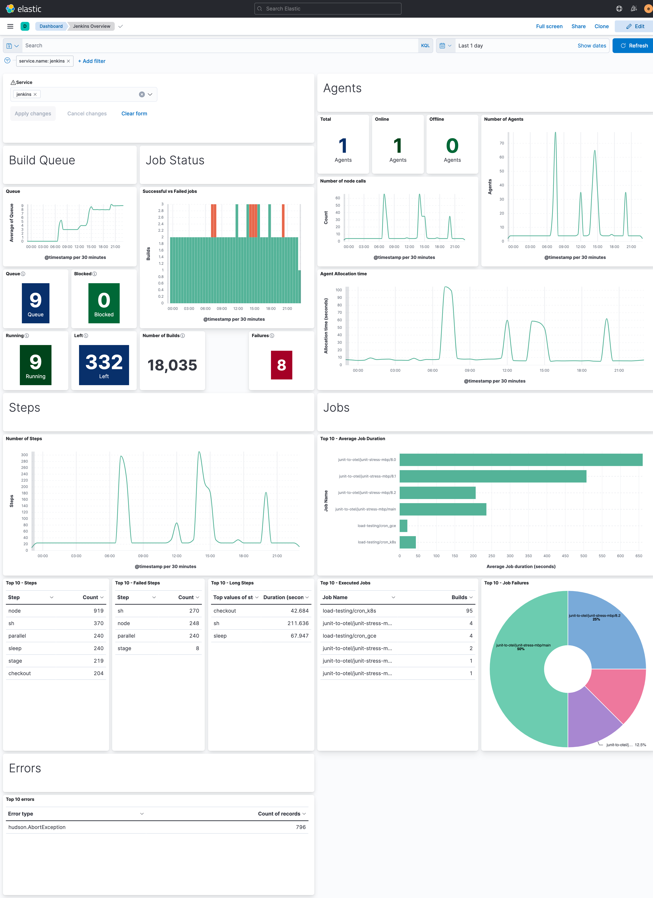
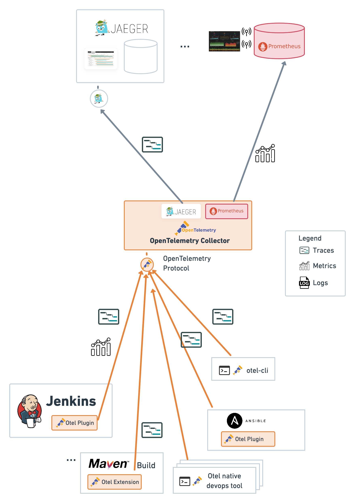
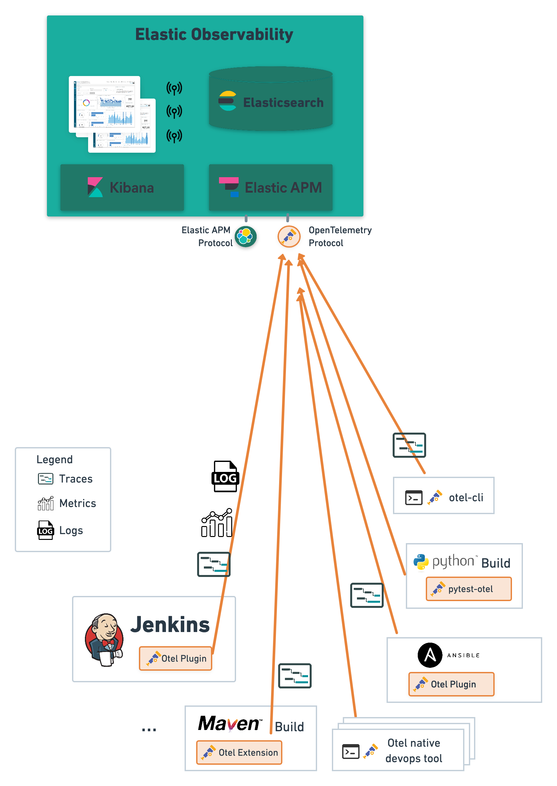
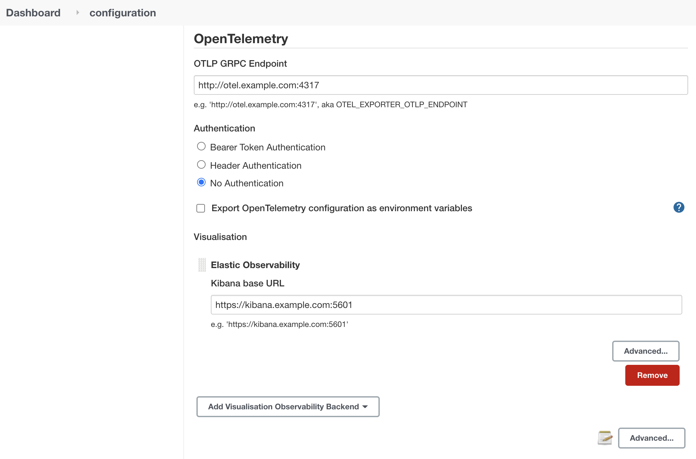

# Jenkins OpenTelemetry Plugin

[](https://ci.jenkins.io/job/Plugins/job/opentelemetry-plugin/job/main/)
[](https://github.com/jenkinsci/opentelemetry-plugin/graphs/contributors)
[](https://plugins.jenkins.io/opentelemetry)
[](https://github.com/jenkinsci/opentelemetry-plugin/releases/latest)
[](https://plugins.jenkins.io/opentelemetry)
[](https://github.com/open-telemetry/opentelemetry-java/releases/tag/v1.44.1)

## Introduction

Monitor and observe Jenkins with OpenTelemetry.

Visualize jobs and pipelines executions as distributed traces:


*Example pipeline execution trace of a SpringBoot Maven going application*

Visualize Jenkins and pipeline health indicators:



*Example Kibana dashboard of the Jenkins and CI jobs health*

Troubleshoot Jenkins performances with distributed tracing of HTTPs requests:


*Example Jenkins HTTP trace*

## Architecture

Using the [OpenTelemetry Collector](https://github.com/open-telemetry/opentelemetry-collector-contrib/releases), you can
use many monitoring backends to monitor Jenkins such as Jaeger, Zipkin, Prometheus, Elastic Observability and many
others listed [here](https://github.com/open-telemetry/opentelemetry-collector-contrib/tree/main/exporter).

Here are example architectures with Elastic, Jaeger, and Prometheus:

| CI/CD Observability with Jaeger and Prometheus                                                                                                                                                                            | CI/CD Observability with Elastic                                                                                                                                                                                |
|---------------------------------------------------------------------------------------------------------------------------------------------------------------------------------------------------------------------------|-----------------------------------------------------------------------------------------------------------------------------------------------------------------------------------------------------------------|
|  |  |

## Getting started

* Set up an OpenTelemetry endpoint such as
  the [OpenTelemetry Collector](https://github.com/open-telemetry/opentelemetry-collector-contrib)
* Install the Jenkins OpenTelemetry plugin
* Configure the Jenkins OpenTelemetry plugin navigating to the "Manage Jenkins / Configure System" screen. In the
  OpenTelemetry section define:
    * "OTLP Endpoint": the hostname and port of the OpenTelemetry GRPC Protocol (OTLP GRPC) endpoint, typically an
      OpenTelemetry Collector or directly an Observability backend that supports the OTLP GRPC protocol
    * "Authentication": authentication mechanism used by your OTLP Endpoint
        * "Header Authentication" : name of the authentication header if header based authentication is used.
        * "Bearer Token Authentication": Bearer token when using header based authentication. Note that Elastic APM
          token authentication uses a "Bearer Token Authentication".
        * "No Authentication"
    * Check "Export OpenTelemetry configuration as environment variables" to easily integrate visibility in other build
      tools (see the otel-cli, the OpenTelemetry Maven extension, the OpenTelemetry Ansible integration...)
    * Visualization: add the backend used to visualize job executions as traces.
        * Elastic Observability
        * Jaeger
        * Zipkin
        * Custom Observability backend for other visualization solutions
* Set up Jenkins health dashboards on your OpenTelemetry metrics visualization solution. See details including guidance
  for Elastic Kibana [here](https://github.com/jenkinsci/opentelemetry-plugin/blob/master/docs/monitoring-metrics.md).



*Example Jenkins OpenTelemetry configuration*

## Setup and Configuration

For details to set up Jenkins with Elastic, Jaeger or Prometheus, to configure the integration including using Jenkins
Configuration as Code,
see [Setup and Configuration](https://github.com/jenkinsci/opentelemetry-plugin/blob/master/docs/setup-and-configuration.md).

## Troubleshooting and Optimizing Jenkins Jobs and Pipelines Using Tracing on the Builds

For details on how to explore and troubleshoot jobs and pipelines builds as traces,
see [Traces of Jobs and Pipeline Builds](https://github.com/jenkinsci/opentelemetry-plugin/blob/master/docs/job-traces.md).


*Example pipeline execution trace of a SpringBoot app built with Maven going through security checks with Snyk, deployed on a Maven repository and published as a Docker image*

## Troubleshooting pipeline plugins and the execution on the Jenkins build agents

For details on the execution of pipeline plugin steps on the Jenkins build agents,
activate tracing in the Jenkins build agents using:

```properties
otel.instrumentation.jenkins.agent.enabled=true
```

To activate detailed traces of the communication from the Jenkins Controller to the Jenkins Agents, activate the
instrumentation of Jenkins remoting with:

```properties
otel.instrumentation.jenkins.remoting.enabled=true
```

Note that the instrumentation of Jenkins remoting is not feature complete and may not capture all the communication
between the Jenkins Controller and the Jenkins Agents.

## Troubleshooting Jenkins Performances Using Tracing on the HTTP Requests of the Jenkins Controller

For details to set up Jenkins with Elastic, Jaeger or Prometheus, to configure the integration including using Jenkins
Configuration as Code,
see [Setup and Configuration](https://github.com/jenkinsci/opentelemetry-plugin/blob/master/docs/setup-and-configuration.md).

## Jenkins Security

Monitor access to Jenkins to detect anomalous behaviours.

For details, see the security logs, metrics, and trace
attributes [here](https://github.com/jenkinsci/opentelemetry-plugin/blob/master/docs/security_obs.md).

## Storing Jenkins Pipeline Logs in an Observability Backend

For details on how to store Jenkins pipelines build logs in an Observability backend like Elastic or Loki,
see [Storing Jenkins Pipeline Logs in an Observability Backend though OpenTelemetry](https://github.com/jenkinsci/opentelemetry-plugin/blob/master/docs/build-logs.md).


*Storing Jenkins pipeline logs in Elasticsearch and visualizing logs both in Kibana and through Jenkins GUI*

## Other CI/CD Tools supporting OpenTelemetry traces

List of other CI/CD tools that support OpenTelemetry traces and integrate with the Jenkins OpenTelemetryPlugin creating
a distributed traces providing end to end visibility.

### OpenTelemetry Maven Extension

The [OpenTelemetry Maven Extension](https://github.com/open-telemetry/opentelemetry-java-contrib/blob/main/maven-extension/)
is a Maven extension to instrument with traces steps of Maven builds, including capturing details of the produced
artifacts for traceability.

ℹ️ For seamless and turnkey integration of the trace of the Maven builds that use the OpenTelemetry Maven Extension with
the Jenkins trace, consider in the Jenkins configuration to enable "Export OpenTelemetry configuration as environment
variables".

### OpenTelemetry Ansible Plugin

The [OpenTelemetry Ansible Plugin](https://docs.ansible.com/ansible/latest/collections/community/general/opentelemetry_callback.html)
is an Ansible callback to instrument with traces the tasks of Ansible playbooks.

ℹ️ For seamless and turnkey integration of the trace of the Ansible playbooks that use the OpenTelemetry plugin with the
Jenkins trace, consider in the Jenkins configuration to enable "Export OpenTelemetry configuration as environment
variables".

### pytest-otel

The [PyTest Otel Plugin](https://pypi.org/project/pytest-otel/) is a PyTest plugin to report each PyTest test as a span
of a trace.

ℹ️ For seamless and turnkey integration of the trace of the PyTest tests that use the OpenTelemetry plugin with the
Jenkins trace, consider in the Jenkins configuration to enable "Export OpenTelemetry configuration as environment
variables".

### Otel CLI

The [`otel-cli`](https://github.com/equinix-labs/otel-cli) is a command line wrapper to observe the execution of a shell
command as an OpenTelemetry trace.

## FAQ

### Enrich your pipeline `sh`, `bat`, and `powershell` steps with meaningful explanation thanks to labels

If you use Jenkins pipelines in conjunction with the `sh`, `bat`, `powershell` steps, then it's highly recommended using
the `label` argument to add a meaningful explanation thanks to step labels. Example:

```groovy
node {
    sh(label: 'Maven verify', script: './mvnw deploy')
}
```

### Using the OpenTelemetry OTLP/HTTP rather than OTLP/GRPC protocol

Navigate to the Jenkins OpenTelemetry Plugin configuration, in the "Advanced" section, add to the "Configuration
Properties text area the following:

```properties
otel.exporter.otlp.protocol=http/protobuf
```

### Support for disabling the Groovy Sandbox and accessing the Jenkins pipeline logs APIs while enabling the Jenkins OpenTelemetry Plugin

No test have been done on disabling the Groovy Sandbox and accessing the Jenkins pipeline logs APIs while enabling the
Jenkins OpenTelemetry Plugin for the following reasons:

* Disabling the Groovy Sandbox is a very advanced use case due to the security implications of doing so
* The surface of Jenkins pipeline logs capabilities exposed by disabling the Groovy sandbox is very broad and goes way beyond the OpenTelemetry plugin

If you are limited with the current capabilities of the Jenkins OpenTelemetry Plugin and consider opening up the Groovy
sandbox to workaround these limitations, please prefer to reach out to us creating an enhancement request so we can work together at productizing the proper secured solution to your problem.

## JCasC configuration reference
JCasC configuration can be defined with the following fields:
```yaml
unclassified:
  openTelemetry:
    authentication: "noAuthentication"
    configurationProperties: "otel.exporter.otlp.protocol=grpc"
    disabledResourceProviders: "io.opentelemetry.instrumentation.resources.ProcessResourceProvider"
    endpoint: "http://otel-collector-contrib:4317"
    exportOtelConfigurationAsEnvironmentVariables: false
    ignoredSteps: "dir,echo,isUnix,pwd,properties"
    observabilityBackends:
      - elastic:
          name: "My Elastic"
          kibanaBaseUrl: "http://localhost:5601"
      - jaeger:
          jaegerBaseUrl: "http://localhost:16686"
          name: "My Jaeger"
      - customObservabilityBackend:
          metricsVisualizationUrlTemplate: "foo"
          name: "My Custom"
          traceVisualisationUrlTemplate: "http://example.com"
      - zipkin:
          name: "My Zipkin"
          zipkinBaseUrl: "http://localhost:9411/"
    serviceName: "my-jenkins"
    serviceNamespace: "ci"
```

Authentication configuration:
- with domain credentials
```yaml
credentials:
  system:
    domainCredentials:
      - credentials:
        - string:
            description: "Server Token"
            id: "server-token"
            scope: GLOBAL
            secret: "password"
unclassified:
  openTelemetry:
    authentication:
      bearerTokenAuthentication:
        tokenId: "server-token"
```

- with username/password:
```yaml
credentials:
  system:
    domainCredentials:
      - credentials:
          - usernamePassword:
              description: Some user/pass
              id: some-logs-creds
              password: my-pass
              scope: GLOBAL
              username: my-user
unclassified:
  openTelemetry:
    observabilityBackends:
      - elastic:
          name: "My Elastic"
          elasticLogsBackend:
            elasticLogsBackendWithJenkinsVisualization:
              elasticsearchUrl: "http://localhost:9200"
              elasticsearchCredentialsId: "some-logs-creds"
              disableSslVerifications: false
      - jaeger:
          name: "My Grafana"
          grafanaLogsBackend:
            grafanaLogsBackendWithJenkinsVisualization:
              lokiUrl: "http://localhost:3100"
              disableSslVerifications: false
              lokiCredentialsId: "some-logs-creds"
              lokiTenantId: "potentialTenant"          
```

## Learn More

* You can look at this video tutorial to get
  started:
  
  [](https://www.youtube.com/watch?v=3XzVOxvNpGM)
* [DevOpsWorld 2021 - Embracing Observability in Jenkins with OpenTelemetry](https://www.devopsworld.com/agenda/session/581459)

## Demos

If you'd like to see this plugin in action with some other integrations then refer to the [demos](demos/README.md).

## Contributing

Refer to our [contribution guidelines](https://github.com/jenkinsci/.github/blob/master/CONTRIBUTING.md)

## LICENSE

Licensed under Apache Software License 2, see [LICENSE](LICENSE)
