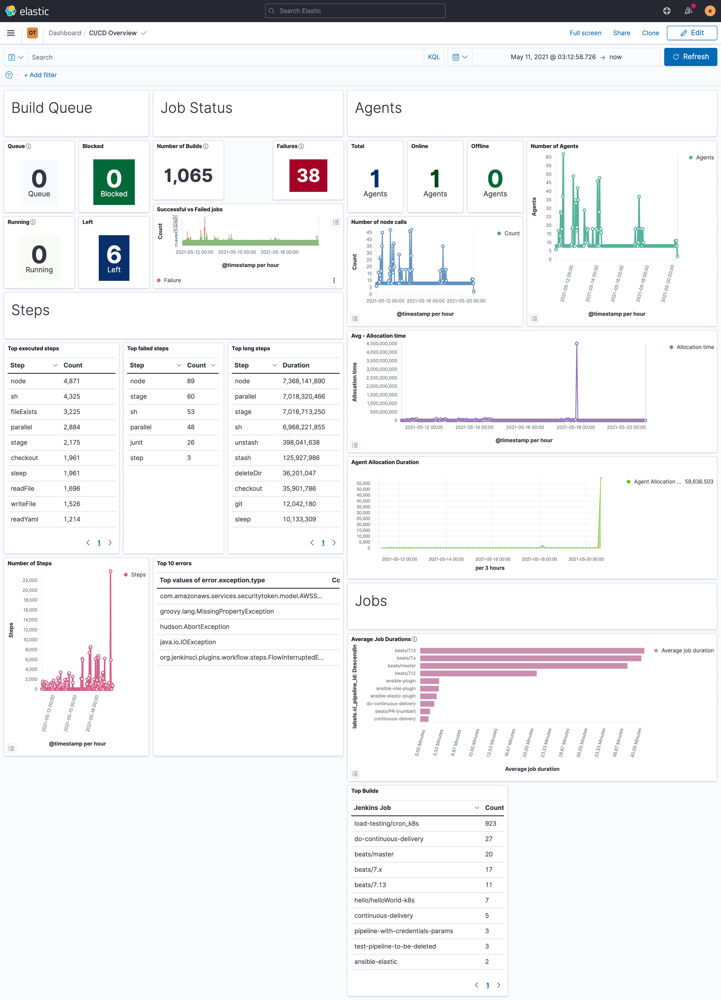
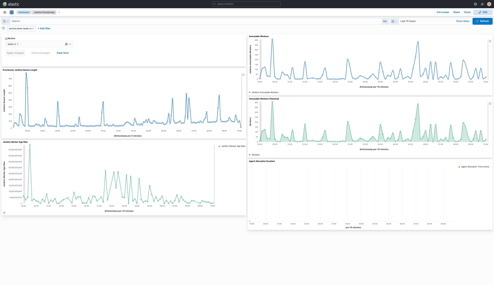

# Dashboards

CICD dashboards to be imported.

## Elastic

Specific dashboards to be imported in you Kibana instance once the plugin has been configured. Supported version >= `7.12`

There are different ways to import a Kibana dashboard:

* Through the [import API](https://www.elastic.co/guide/en/kibana/current/dashboard-import-api.html)
* Through the [UI](https://www.elastic.co/guide/en/kibana/7.12/managing-saved-objects.html#managing-saved-objects-export-objects)

### CICD overview

Import [cicd_overview_dashboard.ndjson](./dashboards/elastic/cicd_overview_dashboard.ndjson) and you will get something like:

### Provisioner

Import [provisioner_dashboard.ndjson](./dashboards/elastic/provisioner_dashboard.ndjson) and you will get something like:

