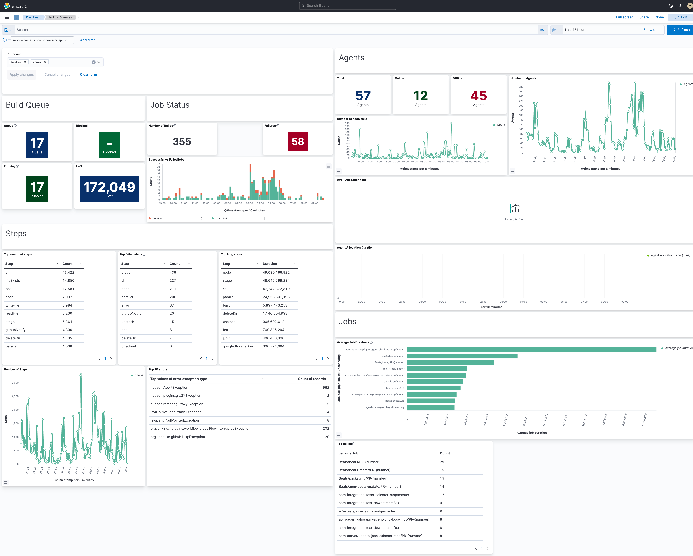
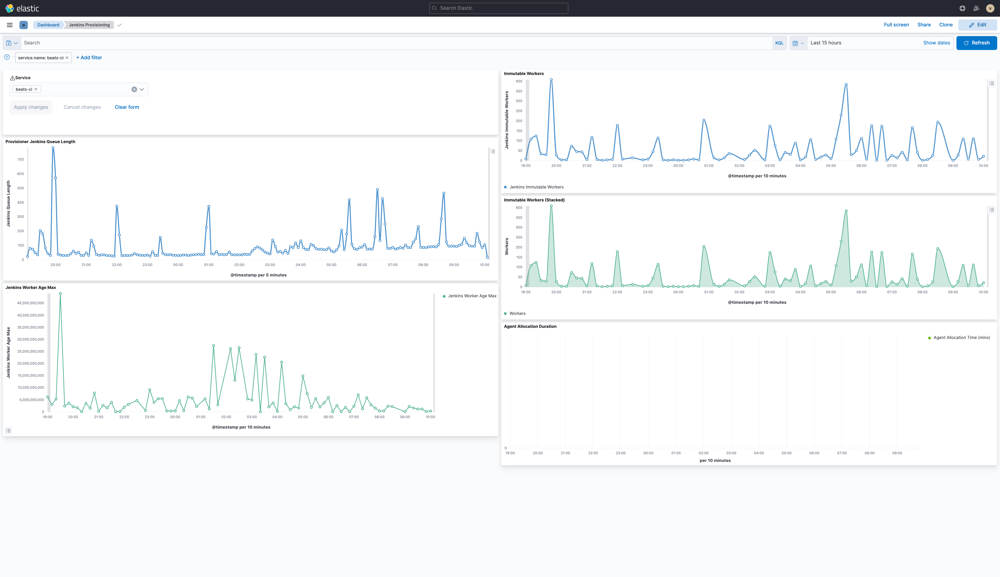

# Dashboards

CI/CD dashboards to be imported.

## Elastic

Specific dashboards to be imported in you Kibana instance once the plugin has been configured. Supported version >= `7.12`

There are different ways to import a Kibana dashboard:

* Through the [import API](https://www.elastic.co/guide/en/kibana/current/dashboard-import-api.html)
* Through the [UI](https://www.elastic.co/guide/en/kibana/7.12/managing-saved-objects.html#managing-saved-objects-export-objects)

### Jenkins Overview and Jenkins Provisioning Kibana Dashboards

Import [jenkins-kibana-dashboards.ndjson](../src/main/kibana/jenkins-kibana-dashboards.ndjson) and you will get something like:

## Grafana

Specific dashboard to be imported in your Grafana instance once the plugin and OpenTelemetry Collector have been configured with Prometheus.

There are different ways to import a Grafana dashboard:

* Through the UI
* Through dashboard provisioning

### Jenkins Overview Grafana Dashboard

Import [jenkins-overview.json](../src/main/grafana/jenkins-overview.json).

For full setup instructions including OTel Collector and Prometheus configuration, see the [Grafana Dashboard Setup Guide](grafana-dashboard-setup.md).
