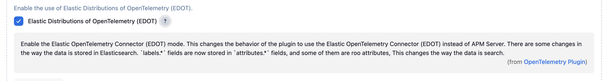

# Elastic OpenTelemetry Collector (EDOT) mode

The Elastic Distribution of OpenTelemetry (EDOT) Collector represents an evolution of the Elastic Agent. In its latest version, the Elastic Agent can operate in an OpenTelemetry mode. This mode invokes a module within the Elastic Agent which is essentially a distribution of the OpenTelemetry collector. It is crafted using a selection of upstream components from the contrib distribution.

This way of ingest `OpenTelemetry logs` is different than using the APM Server.
EDOT allows to configure the OpenTelemetry collector in a more flexible way, removing the need to use the APM Server to ingest data in Elasticsearch.

You can enable the EDOT mode in the OpenTelemetry Jenkins plugin configuration `Manage Jenkins/System Configuration/OpenTelemetry`, there you have a checkbox to enable the EDOT mode. Once you enable it, the plugin will use the logs filters valid for EDOT.

If you do not retrieve the OpenTelemetry logs from the Elastic Stack, this option does not affect you.

## Demo

The current demo is using the OpenTelemetry Jenkins plugin with the EDOT mode enabled. The logs are ingested in the Elastic Stack using the Elastic Agent in EDOT mode.
This demo uses an aditional OpenTelemetry collector that dispatches data to the differnt backends, it cambe removed in final configurations by sending the OpenTelemetry data directly to the EDOT Collector.

To run the demo you can use the following command:

```shell
make -C demo start-edot
```

This command will start the demo using docker-compose. The demo will start a Jenkins instance with the OpenTelemetry Jenkins plugin installed and configured to use the EDOT mode.

It is possible to run the demo against your Elastic Stack, you only need to pass the environment variables with the configuration of your Elastic Stack.
You can create a `.env` file in the `demos` folder, it should look like this:

```env
ELASTICSEARCH_HOST=https://elasticsearch.example.com
ELASTICSEARCH_USERNAME=elastic
ELASTICSEARCH_PASSWORD=changeme
KIBANA_HOST=https://kibana.example.com
OTEL_EXPORTER_OTLP_ENDPOINT=https://edot.example.com:4317
OTEL_EXPORTER_OTLP_HEADERS="Authorization=ApiKey AAAAAAAAAAAAAAAAAAAAAAAAAAAAAAAAAA"
```

Then you can run the docker-compose command:

```shell
make -C demo start-edot
```

This will start the demo using your Elastic Stack configuration. The demo will start a Jenkins instance with the OpenTelemetry Jenkins plugin installed and configured to use the EDOT mode.
You can use the example pipelines to test the OpenTelemetry Jenkins plugin.

## Troubleshooting

### I can't see logs in the console

If you are using EDOT collector you must check that you enabled the EDOT mode in the OpenTelemetry Jenkins plugin configuration. if not the build logs does not appear in the Jenkins Console nor in the pipeline steps.



### I have enabled EDOT mode but I don't see logs in the console

EDOT is available only in the latest version of the Elastic Agent. Check you Elastic Stack is 8.18.0 or later and the Elastic Agent is 8.18.0 or later.
