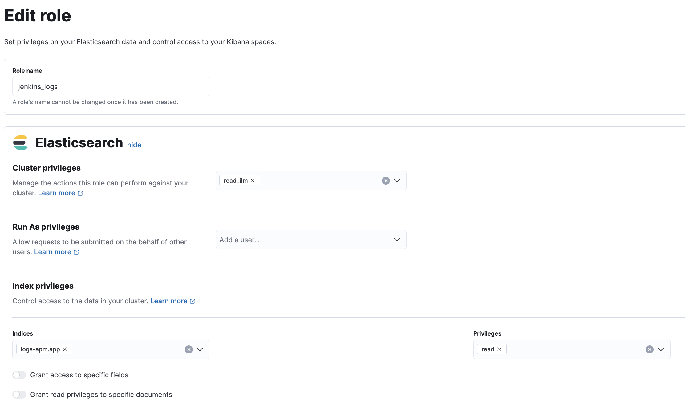
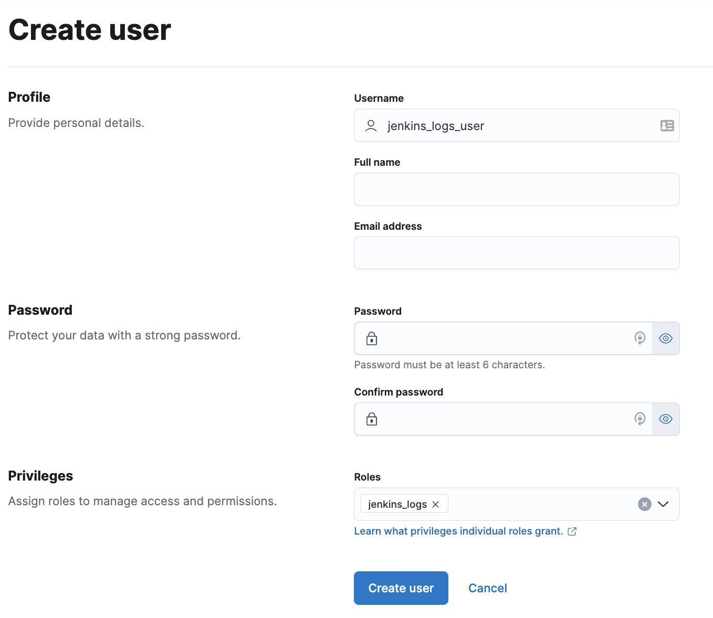

# Storing Jenkins Pipeline Logs in an Observability Backend though OpenTelemetry (version 2.0.0+)

Jenkins pipeline build logs can be sent through OpenTelemetry Protocol in order to be stored in an observability backend alongside the traces of the pipeline builds and the health metrics of Jenkins. Doing so provides the following benefits
* Better observability, monitoring, alerting, and troubleshooting of the Jenkins instance thanks to the unification of all the signals in the observability backend
* Better traceability and audit of the Software Delivery Lifecycle having better control on the long term storage of the builds
* Better scalability and reliability of Jenkins greatly reducing the quantity of data stored in Jenkins home and limiting the well known file system performance challenges of Jenkins when storing a large history of builds

> **_BEST PRACTICE:_** When sending Jenkins pipeline logs through OpenTelemetry, it is recommended to deploy OpenTelemetry Collectors next to the Jenkins deployment for improved scalability and reliability.

## Storing Jenkins Pipeline Logs in Elastic (Elastic v8.1+)

> **_PRE REQUISITES:_** storing Jenkins pipeline logs in Elasticsearch requires :
> * Elastic Observability version 8.1+
> * The OTLP endpoint configured on the Jenkins OpenTelemetry plugin configuration MUST be reachable from the Jenkins Agents (don't specify a `localhost` OTLP endpoint unless OpenTelemetry collectors are also deployed on the Jenkins Agents)
> * When using OpenTelemetry Collectors, requires setting up a logs pipeline in addition to the traces and metrics pipelines. See FAQ below

To store pipeline logs in Elastic,

* Navigate to the OpenTelemetry section of Jenkins configuration screen,
* Ensure the OTLP configuration is set
* Add the Elastic Observability backend
* Set the Kibana URL
* Click on the "Advanced" button to choose the storage integration strategy


### Storing Jenkins Pipeline Logs in Elastic visualizing logs in Kibana

The Jenkins OpenTelemetry provides turnkey storage of pipeline logs in Elasticsearch with visualization in Kibana.
The Jenkins pipeline build console then displays a hyperlink to Kibana rather than displaying the logs.


#### Example configuration


#### Architecture


### Storing Jenkins Pipeline Logs in Elastic visualizing logs both in Kibana and through the Jenkins build console

The Jenkins OpenTelemetry can also store of pipeline logs in Elasticsearch proving visualization of pipeline logs in Kibana while continuing to display them through the Jenkins pipeline build console.


This more advanced setup requires connecting from the Jenkins Controller to Elasticsearch with read permissions on the `logs-apm.app` and preferably on the Metadata of the ILM policy of this index template (by default it's the `logs-apm.app_logs-default_policy` policy).

Please use the "Validate Elasticsearch configuration" to verify the setup.

> :warning: If you add some Jenkins Logging for the OpenTelemetry plugin then the build logs won't be shown in Elastic.

#### Configuration


#### Log Exporter Configuration

* To export logs to an OTLP endpoint, configure the following environment variables:
- `otel.logs.exporter=otlp` : Specifies that logs should be exported using the OTLP exporter.
- `otel.logs.mirror_to_disk=true` : Ensure logs are written to disk, making them visible
- in local systems(eg., Jenkins) in addition to the observability platform.
#### Architecture


#### Configuring Roles/Users in Elastic

In order to retrieve the logs from Elasticsearch you can configure an Elastic user with the required permissions, please follow the below steps.

1. Create the role `jenkins_logs` in your Kibana instance.




2. Create the user `jenkins_logs_user` in your Kibana instance



   
3. Ensure your project includes OTLP exporter dependency. For Maven. add the following to your `pom.xml`:
   ```
     <dependency>
       <groupID>io.opentelemetry</groupID>
       <artifactID>opentelemetry-exporter-otlp</artifactID>
       <version>1.30.0</version>
     </dependency>
   ```
  

5. Configure the following environment variables:
   ```properties
   otel.logs.exporter=otlp
   otel.logs.mirror_to_disk=true
   ```

6. Start your application and verify that logs are being exported 
   to the OTLP endpoint and are also visible locally.


#### Configuration Examples for Different Use Cases
  *  Using Logback with OTLP Exporter
     Add the following to your `logback.xml` :
     ```xml
     <appender name="OTLP" class="io.opentelemetry.instrumentation.logback.appender.v1_0.OpenTelemetryAppender">
     <exporter>otlp</exporter>
     </appender>

* Deploying in Kubernetes
  See the environment variables in your Kubernetes YAML:
  ```
  env:
  - name: otel.logs.exporter
    value: "otlp"
  - name: otel.logs.mirror_to_disk
    value: "true"

#### Storing Jenkins Pipeline Logs in Loki

To store pipeline logs in Loki,

* Navigate to the OpenTelemetry section of Jenkins configuration screen,
* In the "Visualization" section, add the "Grafana" backend
* Set the Grafana URL
* In the section "Pipeline logs storage in Loki", select the desired strategy:
  * "Don't store logs in Loki" to continue storing logs exclusively in Jenkins
  * "Store pipeline logs in Loki and mirror them in Jenkins" to store logs in Loki and also store them in the Jenkins 
    home. Logs can be visualized from the Jenkins GUI retrieving them from the Jenkins home storage, and from Grafana retrieving them from Loki   
  * "Store pipeline logs In Loki and visualize logs exclusively in Grafana (logs no longer visible through Jenkins 
    screens)" to store logs exclusively in Loki. Pipeline logs are no longer visible through Jenkins screens, 
    an hyperlink to Grafana is displayed in the Jenkins pipeline build console.


## FAQ

### Enabling logs forwarding on the OpenTelemetry Collector

OpenTelemetry collectors requires to define a [logs pipeline](https://opentelemetry.io/docs/collector/configuration/#service) in order to transfer the logs received by the receivers like the [OTLP receiver](https://github.com/open-telemetry/opentelemetry-collector/tree/main/receiver/otlpreceiver) to the observability backends.

Minimalistic example of an OpenTelemetry Collector transferring all signals, traces, metrics, and logs, to Elastic Observability.

````yaml
receivers:
  otlp:
    protocols:
      grpc:
        endpoint: '0.0.0.0:4317'
        # auth: enable authentication when needed
  #...
processors:
  batch:
exporters:
  otlp/xyz:
    endpoint: "otlp.example.com:4317"
    #...
service:
  pipelines:
    metrics:
      receivers: [otlp]
      processors: [batch]
      exporters: [otlp/xyz]
    traces:
      receivers: [otlp]
      processors: [batch]
      exporters: [otlp/xyz]
    logs:
      receivers: [otlp]
      processors: [batch]
      exporters: [otlp/xyz]
````

For more details, se the OpenTelemetry Collector [configuration guide](https://opentelemetry.io/docs/collector/configuration/).

### From where are the pipeline logs emitted? The Jenkins Controller? The Jenkins Agents? Both?

Pipeline logs are emitted both from the Jenkins controller and the Jenkins Agents according to where the code that emit logs is executing.
This means that the Jenkins agents establish a connection to the OpenTelemetry endpoint

### How are OpenTelemetry signals impacted by clock de-synchronization between the Jenkins controller and Jenkins Agents?

The Jenkins OpenTelemetry logs integration evaluates the time offset between the system clocks on the Jenkins Controller and the Jenkins Agents.
This offset is applied on the timestamp of the log messages emitted from the Jenkins Agents.
This means that the timestamp of log messages emitted on the Jenkins Agents doesn't rely on the system clock of the agent but on the time on the Jenkins Controller with a compensation.
This clock adjustment is required to display in the right ascending order the log messages.
Note that distributed traces don't require such a clock adjustment because all spans are emitted from the Jenkins Controller.

### Can pipeline logs be stored in other backends than Elastic or Grafana?

Yes any observability backend that support OpenTelemetry logs can be used.

To enable sending pipeline logs to an observability backend for which the Jenkins OpenTelemetry Plugin doesn't provide a dedicated configuration screen with support for logs (ie "Add Visualization Observability Backend" button in the Jenkins OpenTelemetry Plugin configuration), add the configuration property `otel.logs.exporter=otlp` in the "Configuration properties" of the plugin ("Advanced" section) of the plugin.


**Known limitation:** The definition of the link to visualize pipeline logs is not yet supported (screenshot below). Users should navigate to the pipeline logs through the pipeline trace link defined in the Custom Observability Visualization Backend configuration.


### Can build logs be saved in the build folder locally?
Yes, by adding the configuration property `otel.logs.mirror_to_disk=true` in the "Configuration properties" of the plugin ("Advanced" section) of the plugin.
With this property, logs will be sent to the otel endpoint and also be stored in the Jenkins build folder.
Build console log will display the log from the build folder. If no log file is available then configured backend visualization will be displayed.

### Can the Jenkins server logs and the logs of other types of jobs like Freestyle or Matrix jobs be sent through OpenTelemetry to be stored outside of Jenkins?

We would like to implement this as well, it's an Open Source initiative, contributions are welcome

### Why cannot I see the build logs but some OpenTelemetry logs?

That happens if the Jenkins logging was enabled for any of the classes of the OpenTelemetry plugin.

Please remove them from your Jenkins controller in, http://jenkins:8080/manage/log/
