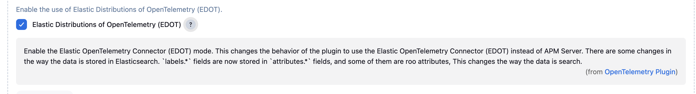

# Troubleshooting

This guide covers the most common issues encountered when setting up and using the Jenkins OpenTelemetry plugin.

---

## Table of contents

- [No traces appearing in backend](#no-traces-appearing-in-backend)
- [OTLP connection refused or timeout](#otlp-connection-refused-or-timeout)
- [Metrics missing in Prometheus](#metrics-missing-in-prometheus)
- [Pipeline logs not visible in Elastic or Loki](#pipeline-logs-not-visible-in-elastic-or-loki)
- [ClassCircularityError on plugin install](#classcircularityerror-on-plugin-install)
- [Traces appear but spans are missing stages](#traces-appear-but-spans-are-missing-stages)
- [Build agents cannot reach the OTLP endpoint](#build-agents-cannot-reach-the-otlp-endpoint)
- [Enabling debug logging](#enabling-debug-logging)
- [Elastic APM](#elastic-apm)
  - [Build logs are truncated when a pipeline step outputs a large number of lines](#build-logs-are-truncated-when-a-pipeline-step-outputs-a-large-number-of-lines)
  - [Log records are rejected by the Elastic APM Server with an "event too large" error](#log-records-are-rejected-by-the-elastic-apm-server-with-an-event-too-large-error)
- [EDOT](#edot)
  - [I can't see logs in the console](#i-cant-see-logs-in-the-console)
  - [I have enabled EDOT mode but I don't see logs in the console](#i-have-enabled-edot-mode-but-i-dont-see-logs-in-the-console)

---

## No traces appearing in backend

**Symptom:** Builds complete successfully but no traces appear in Jaeger, Grafana Tempo, Elastic, or your chosen backend.

**Checklist:**

1. **Verify the OTLP endpoint is set.**
   Navigate to **Manage Jenkins &rArr; Configure System &rArr; OpenTelemetry** and confirm the *OTLP Endpoint* field is filled in (e.g. `http://otel-collector:4317`).

2. **Confirm the endpoint is reachable from the Jenkins controller.**
   Run a quick connectivity check from the Jenkins host:
   ```bash
   curl -v http://<your-otlp-host>:4317
   # For OTLP/HTTP:
   curl -v http://<your-otlp-host>:4318/v1/traces
   ```

3. **Check Jenkins system logs.**
   Go to **Manage Jenkins &rArr; System Log** and look for any `io.jenkins.plugins.opentelemetry` entries at `WARNING` or `SEVERE` level.

4. **Verify the OpenTelemetry Collector is running and has a traces pipeline.**
   Your collector config must include a `traces` pipeline. Minimal example:
   ```yaml
   receivers:
     otlp:
       protocols:
         grpc:
           endpoint: 0.0.0.0:4317
   exporters:
     jaeger:
       endpoint: jaeger:14250
       tls:
         insecure: true
   service:
     pipelines:
       traces:
         receivers: [otlp]
         exporters: [jaeger]
   ```

5. **Check that your backend is receiving on the correct port.**
   The plugin defaults to OTLP/gRPC on port `4317`. If your backend uses OTLP/HTTP, see [Using OTLP/HTTP instead of OTLP/gRPC](setup-and-configuration.md).

---

## OTLP connection refused or timeout

**Symptom:** Jenkins logs show errors like `io.grpc.StatusRuntimeException: UNAVAILABLE: Connection refused` or exports time out silently.

**Causes and fixes:**

| Cause | Fix |
|---|---|
| Wrong hostname or port in the OTLP endpoint field | Double-check the value - use `http://host:4317` for gRPC, `http://host:4318` for HTTP |
| Firewall blocking port 4317 or 4318 | Open the port between the Jenkins controller and collector |
| TLS mismatch - plugin using plain HTTP, collector expecting TLS | Either add `otel.exporter.otlp.insecure=true` in *Configuration Properties* or configure TLS on both sides |
| Using `localhost` as the endpoint | `localhost` resolves to the Jenkins controller itself. Use the actual hostname or IP of the collector |

**To allow insecure (non-TLS) connections**, add the following in **Manage Jenkins &rArr; Configure System &rArr; OpenTelemetry &rArr; Advanced &rArr; Configuration Properties**:

```
otel.exporter.otlp.insecure=true
```

---

## Metrics missing in Prometheus

**Symptom:** Traces arrive correctly but Prometheus shows very few metrics - typically only `otlp_exporter_seen`, `queueSize`, and a handful of span counters. Pipeline duration and health metrics are absent.

**Cause:** Prometheus only supports the metrics signal. The plugin exports metrics via the OpenTelemetry Collector using a Prometheus exporter. The collector config must explicitly include a `metrics` pipeline, and `resource_to_telemetry_conversion` should be enabled so OpenTelemetry resource attributes become Prometheus labels.

**Working collector config for Prometheus:**

```yaml
receivers:
  otlp:
    protocols:
      grpc:
        endpoint: 0.0.0.0:4317

exporters:
  prometheus:
    endpoint: 0.0.0.0:8889
    resource_to_telemetry_conversion:
      enabled: true   # converts resource attributes to Prometheus labels

service:
  pipelines:
    metrics:
      receivers: [otlp]
      exporters: [prometheus]
    traces:             # keep traces pipeline if you also need traces
      receivers: [otlp]
      exporters: [...]
```

**Also check:**

- The `ci.pipeline.run.duration` metric is controlled by an allow-list. By default it matches nothing (`$^`). Set it via:
  ```
  otel.instrumentation.jenkins.run.metric.duration.allow_list=.*
  ```
  in *Configuration Properties* to enable duration metrics for all jobs. Use a specific regex (e.g. `my-team/.*`) to limit cardinality.

- Prometheus scrapes metrics from the collector's `/metrics` endpoint (default port `8889`). Confirm it is reachable: `curl http://<collector-host>:8889/metrics`.

---

## Pipeline logs not visible in Elastic or Loki

**Symptom:** Traces and metrics work, but build logs do not appear in Elastic Kibana or Grafana Loki.

**Cause:** Log export is not enabled by default. You must explicitly configure it.

**To enable log export, add to *Configuration Properties*:**

```
otel.logs.exporter=otlp
```

**Additional requirements:**

- Sending logs to Elastic requires **Elastic v8.1.0 or later**.
- Logs are emitted from both the Jenkins controller and build agents. The **OTLP endpoint must be reachable from all agents**, not just the controller. Do not use `localhost` as the endpoint if agents run on separate hosts.
- The OpenTelemetry Collector must have a `logs` pipeline in addition to `traces` and `metrics`:
  ```yaml
  service:
    pipelines:
      logs:
        receivers: [otlp]
        exporters: [otlp/elastic]   # or loki, or another logs backend
  ```

**To mirror logs both to the backend and keep them visible in the Jenkins GUI**, add:
```
otel.logs.mirror_to_disk=true
```

> ⚠️ If you add Jenkins Logger configuration for the OpenTelemetry plugin packages (`io.jenkins.plugins.opentelemetry`), build logs will not be forwarded to Elastic. Remove custom loggers for this package if logs are missing.

---

## ClassCircularityError on plugin install

**Symptom:** After installing the plugin, Jenkins logs show:

```
java.lang.ClassCircularityError: io/opentelemetry/sdk/metrics/internal/exemplar/RandomFixedSizeExemplarReservoir
```

Jenkins may become unstable or certain threads may die unexpectedly.

**Cause:** A classloader conflict between the `opentelemetry-api` plugin and another plugin (commonly the Kubernetes plugin) that also loads OpenTelemetry classes. This is a known issue ([#1201](https://github.com/jenkinsci/opentelemetry-plugin/issues/1201)).

**Workarounds:**

1. **Restart Jenkins** - the error often does not recur after a clean restart.
2. **Update all plugins** - ensure `opentelemetry-api` and `opentelemetry` plugins are both on the latest version. Mismatched versions are the most common trigger.
3. **Check for duplicate OpenTelemetry JARs** - if another plugin bundles its own OpenTelemetry SDK, there may be a version conflict. Check the plugin's dependencies or raise an issue with the conflicting plugin.

---

## Traces appear but spans are missing stages

**Symptom:** A root span appears for the build but individual pipeline stages or steps are missing from the trace.

**Checklist:**

1. **Scripted vs Declarative pipeline:** Both are supported, but some older `node` block patterns in scripted pipelines may not emit stage spans. Use named `stage()` blocks where possible.

2. **Parallel stages:** Each parallel branch creates its own child span. If a branch runs on a different agent, ensure that agent can also reach the OTLP endpoint.

3. **Missing step spans for shell commands:** By default, `sh`, `bat`, and `powershell` steps are traced. If you want to wrap a shell command in a custom span, use `otel-cli`:
   ```groovy
   sh 'otel-cli exec --name "run-tests" -- ./run-tests.sh'
   ```

4. **`withSpanAttribute` not appearing:** Attributes added with `withSpanAttribute` apply to the current span. If you want an attribute on the root build span, use `target: "PIPELINE_ROOT_SPAN"`:
   ```groovy
   withSpanAttribute(key: "team", value: "platform", target: "PIPELINE_ROOT_SPAN")
   ```

---

## Build agents cannot reach the OTLP endpoint

**Symptom:** Traces are created but span data from agent-side steps is missing, or build logs are not forwarded when using Loki/Elastic.

**Cause:** Pipeline logs and agent-side steps are exported **directly from the agent** to the OTLP endpoint - not proxied through the Jenkins controller.

**Fix:**

- Set the OTLP endpoint to a hostname or IP reachable from all agents, not `localhost`.
- If agents are on a different network segment, deploy an OpenTelemetry Collector on each agent or ensure network routing allows direct access.
- Enable the configuration option **Export OpenTelemetry configuration as environment variables** so agents automatically inherit the correct endpoint URL.

---

## Enabling debug logging

To see detailed plugin activity, add a Jenkins logger for the package `io.jenkins.plugins.opentelemetry` at `FINE` or `FINEST` level:

1. Go to **Manage Jenkins &rArr; System Log &rArr; New Log Recorder**.
2. Name it `OpenTelemetry`.
3. Add a logger for `io.jenkins.plugins.opentelemetry` at level `FINE`.
4. Trigger a build and inspect the log recorder output.

> ⚠️ **Important:** Adding a logger for `io.jenkins.plugins.opentelemetry` while using the build logs feature will prevent logs from being forwarded to your observability backend (Elastic, Loki). Disable the logger once debugging is complete.

You can also set the SDK-level log level using the `Configuration Properties` field:

```
otel.javaagent.logging=simple
```

---

## Elastic APM

### Build logs are truncated when a pipeline step outputs a large number of lines

**Symptom:** A pipeline step that produces a high volume of log output (e.g. `sh "cat bigfile.txt"` or any step
echoing thousands of lines) results in only a portion of the lines being stored in the observability backend.
Subsequent steps log correctly; only the large burst of output is cut short.

**Root cause:** The OpenTelemetry Java SDK ships a `BatchLogRecordProcessor` with a default in-memory queue size
of 2048 log records. When a pipeline step emits logs faster than the exporter can drain the queue, the queue
fills up and new records are dropped. The SDK exposes an internal metric to confirm this:

```
Metric name: processedLogs
Description: The number of logs processed by the BatchLogRecordProcessor.
             [dropped=true if they were dropped due to high throughput]
Attributes:  dropped=true, processorType=BatchLogRecordProcessor
```

If the counter for `dropped=true` is non-zero after a build, queue overflow is occurring.

**Fix:** Increase the queue size via the `otel.blrp.max.queue.size` configuration property. Add the property in
the **"Configuration properties"** field of the plugin **Advanced** section:

```
otel.blrp.max.queue.size=<value>
```

A value of roughly **75 % of the maximum number of log lines** expected in a single step is a good starting
point (e.g. `otel.blrp.max.queue.size=6000` for a step that can emit ~8000 lines).

**Related configuration properties:**

| Property | Default | Description |
| -------- | ------- | ----------- |
| `otel.blrp.max.queue.size` | 2048 | Maximum number of log records held in the in-memory queue before records are dropped. |
| `otel.blrp.max.export.batch.size` | 512 | Maximum number of records sent to the exporter in a single batch. |
| `otel.blrp.schedule.delay` | 1000 ms | Delay between consecutive export attempts when the batch has not yet reached its maximum size. |

> **Note:** Tuning the plugin alone may not be sufficient. The OpenTelemetry Collector and the observability
> backend (e.g. Elastic APM Server) must also be able to handle the increased throughput. See
> [Enabling logs forwarding on the OpenTelemetry Collector](#enabling-logs-forwarding-on-the-opentelemetry-collector)
> and the section below.

---

### Log records are rejected by the Elastic APM Server with an "event too large" error

**Symptom:** Log lines are emitted by Jenkins but are not stored in Elasticsearch. The APM Server logs contain
an error similar to:

```
event exceeded the permitted size
```

**Root cause:** The Elastic APM Server enforces a configurable maximum size per event
(`apm-server.max_event_size`, default 300 KiB). A single log record that exceeds this limit is silently
dropped by the server.

**Fix:** Either reduce the size of individual log records or increase the limit in the APM Server
configuration:

```yaml
apm-server:
  max_event_size: 614400  # 600 KiB – adjust as needed
```

Refer to the Elastic documentation for details:

- [Common problems – event too large](https://www.elastic.co/guide/en/apm/server/current/common-problems.html#event-too-large)
- [APM Server process configuration – max_event_size](https://www.elastic.co/guide/en/observability/current/apm-configuration-process.html#apm-max_event_size)

---

## EDOT

### I can't see logs in the console

If you are using EDOT collector you must check that you enabled the EDOT mode in the OpenTelemetry Jenkins plugin configuration. if not the build logs does not appear in the Jenkins Console nor in the pipeline steps.



---

### I have enabled EDOT mode but I don't see logs in the console

EDOT is available only in the latest version of the Elastic Agent. Check you Elastic Stack is 8.18.0 or later and the Elastic Agent is 8.18.0 or later.

---

## Still stuck?

- Search existing [GitHub Issues](https://github.com/jenkinsci/opentelemetry-plugin/issues) - many configuration problems have been reported and resolved there.
- Open a new issue using the bug report template and include:
  - Jenkins version
  - Plugin version (`opentelemetry` and `opentelemetry-api`)
  - Relevant Jenkins system log excerpts
  - Your OTLP endpoint type (Collector, Elastic, Grafana Cloud, etc.)